# Discord Music Bot

<p align="center">
    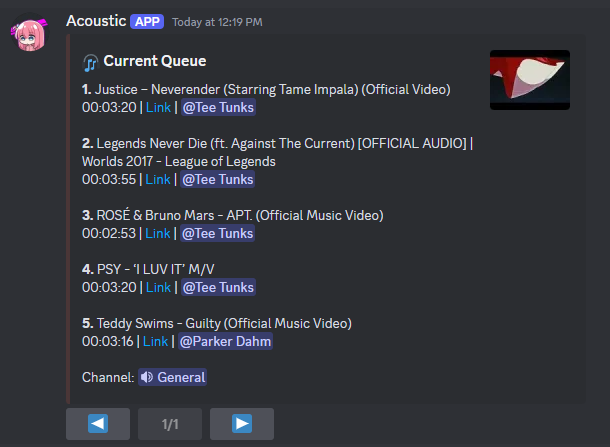
</p>

A Discord bot that allows users to play music from YouTube in a voice channel with custom commands for search, play, pause, and more.
Supports multiple tracks, queue management, and interactive selection.

The main tools used are `youtube-dl` for pulling YouTube data and [FFmpeg](https://www.ffmpeg.org/) for audio streaming.

I used cogs since I adapt this code onto other bots that I have. It makes it a bit more modular since I can simply add the `Music` cog to a pre-existing bot.

## Features
See [Usage](#usage) for more information and examples on specific commands and features.
- Search and play YouTube music directly in voice channels
- Queue management with pagination
- Support for multiple guilds via Sessions
- Select music interactively with interactions
- Auto leaving when channel is empty or no music is playing

## Usage

<details>
  <summary>`!!search <song name>` - Searches Youtube results</summary>

  Searches YouTube for the top 20 results for the user to select which one to add to the queue.

    <p align="center">
        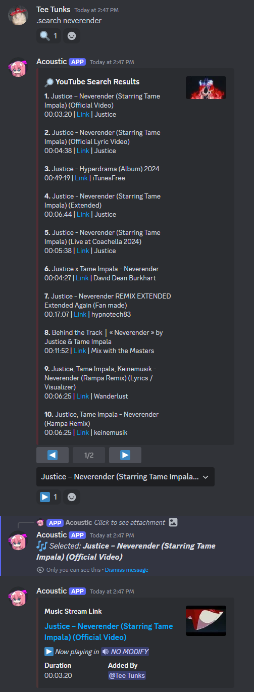
    </p>
</details>

<details>
  <summary>`!!play <song name or YouTube URL>` - Plays a song or adds it to queue</summary>

  Searches for a song and plays the first result in the voice channel.

    <p align="center">
        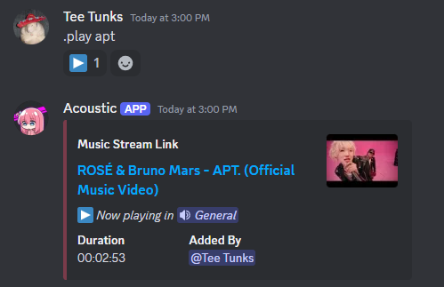
        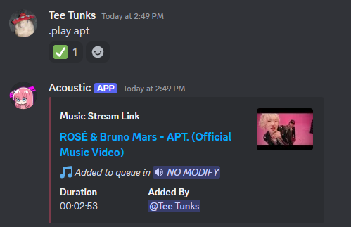
    </p>
</details>

<details>
  <summary>`!!pause` - Pauses the currently playing song</summary>

    <p align="center">
        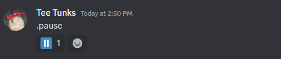
    </p>
</details>

<details>
  <summary>`!!resume` - Resumes the currently paused song</summary>

    <p align="center">
        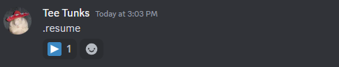
    </p>
</details>

<details>
  <summary>`!!skip` - Skips to the next song in the queue</summary>

  - Alias: `!!next`

  Skips the current song and plays the next one in the queue if available. The skipped song is not removed from the queue.

    <p align="center">
        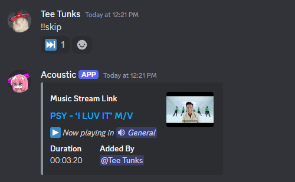
    </p>
</details>

<details>
  <summary>`!!stop` - Stops playing audio and clears the queue</summary>

  - Alias: `!!reset`

  Stops playing audio and clears the queue.

    <p align="center">
        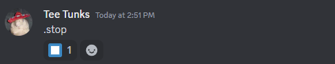
    </p>
</details>

<details>
  <summary>`!!here` - Moves the bot into the user's voice channel</summary>

  Moves the bot to the user's current voice channel and updates the session.

    <p align="center">
        
    </p>
</details>

<details>
  <summary>`!!leave` - Disconnects the bot from the voice channel and clears the queue</summary>

    <p align="center">
        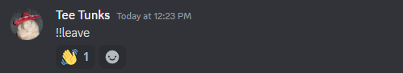
    </p>
</details>

<details>
  <summary>`!!clearqueue` - Clears the queue, except the currently playing song</summary>

  - Alias: `!!clearQueue`, `!!cq`, `!!clear_next`, `!!clearnext`, `!!clearNext`, `!!cn`

    <p align="center">
        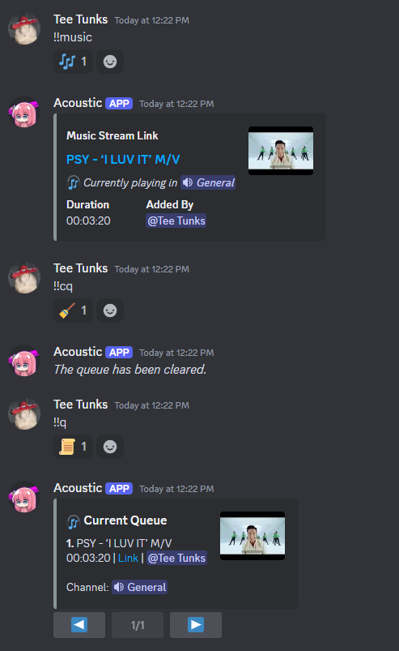
    </p>
</details>

<details>
  <summary>`!!playingnow` - Gets the current song playing</summary>

  - Alias: `!!playingNow`, `!!playing`, `!!music`, `!!nowplaying`, `!!nowPlaying`, `!!now`, `!!musicnow`, `!!musicNow`

    <p align="center">
        
    </p>
</details>

<details>
  <summary>`!!queue` - Displays the current queue of songs</summary>

  - Alias: `!!q`

  Displays the current queue of songs in groups of 10.

    <p align="center">
        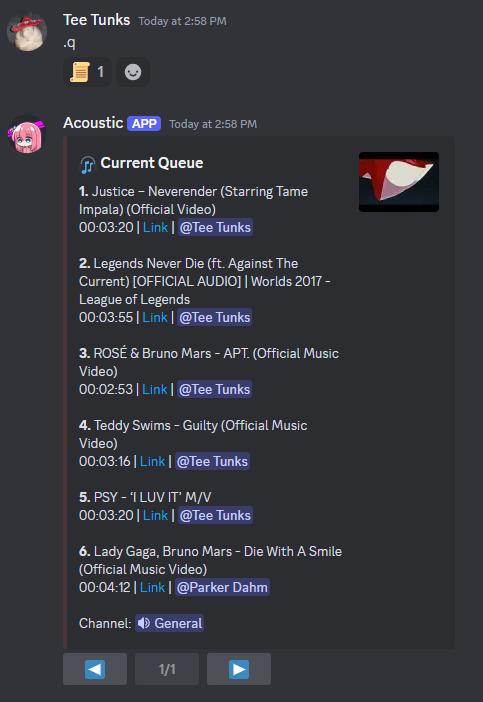
    </p>
</details>

**Other Utility Commands**
| Command                            | Description                                                                                   |
|------------------------------------|-----------------------------------------------------------------------------------------------|
| `!!help`                             | Shows this help message.                                                                      |
| `!!ping`                             | Test command to check for basic bot responsiveness.                                           |
| `!!time`                             | Displays the current time.                                                                    |
| `!!up`                               | Reports container ID and uptime.                                                              |

## Installation Steps

### Creating a bot

1. **Create a Discord bot**:
   - Go to the [Discord Developer Portal](https://discord.com/developers/applications).
   - Click "New Application" and give your bot a name.
   - Under the "Bot" tab, click "Add Bot" and confirm.
   - In the "TOKEN" section, click "Copy" to save your bot token, which will be used in your `.env` file.

2. **Set up permissions**:
   - In the "OAuth2" tab, select "bot" under "scopes."
   - Under "Bot Permissions," select the necessary permissions (such as "Send Messages," "Manage Messages," "Connect," "Speak," etc.).

3. **Invite your bot to a server**:
   - In the "OAuth2" tab, use the generated URL to invite the bot to your Discord server.

### Running through Docker

1. **Clone the repository**:
   ```bash
   git clone https://github.com/estes-sj/discord-music-bot.git
   cd discord-music-bot
   ```

2. **Create a `.env` file**:
   Create a `.env` file in the root directory of the project and add the following values:
   ```env
   DISCORD_TOKEN=your-bot-token
   ```

3. **Run the bot with Docker Compose**:

   Included is a `docker-compose.yaml`. To run the bot with `docker-compose`, follow these steps:

   1. Make sure the `.env` file is in the root directory of the project (where your `docker-compose.yaml` file is located).
   2. In the terminal, navigate to the directory with the `docker-compose.yaml` file.
   3. Use the following command to start the bot:
   ```bash
   docker-compose up -d --build
   ```

4. **Bot should now be live**:
   - Once the bot is running, it should appear online in your Discord server and be able to join voice channels and play music.

## Configuration

### Environment Variables
- `DISCORD_TOKEN`: The bot's token from the Discord Developer Portal.

### Discord.py and Bot Settings
- `main.py`'s lines ~15-70 contain configurable settings that can be altered to better fit the user's needs. Commonly changed variables that can be searched for in the first part of `main.py` are:
  - `command_prefix` - Set to `!!` but can be switched to whatever else (e.g. `!`, `?`, etc.)
    - If changing, the `activity` name above it should be changed too
  - `logger.setLevel(logging.INFO)` - Can be changed to other levels such as `DEBUG`, `WARNING`, `ERROR` based on what is needed
  - `maxBytes` - The max bytes of each log file
  - `backupCount` - The max number of backup files stored. Each have a max size of `maxBytes`
- The `docker-compose.yaml` maps the volume `/var/run/docker.sock:/var/run/docker.sock` to allow docker commands inside of the container. The only use in this particular bot is for the `!!up` command that returns the uptime of the instance. Some may find it overkill and can remove the volume mapping and/or content for `up` in `sever_assistant_cog.py`. Personally, I use it for other controlling other related containers in other bots.

## Future Work

### New Features
Feel free to suggest others.

- Adding a database to allow features:
  - "Liking" a song (requires storing user/guild data)
  - Most played/liked songs in the guild
  - Most played/liked songs for all bot users (across multiple guilds)
  - Playlists
- Restarting a song
- Removing an index from the queue
- Skipping to a particular index in the queue
- Shuffling a queue

### Bugs
Will address bugs as I find them through my own personal use of the bot. Feel free to open an issue, create a PR, or reach out to me for other issues found.

## License

This project is licensed under the GNU General Public License v3.0 - see the [LICENSE](LICENSE) file for details.