# Discord Music Bot

<p align="center">
    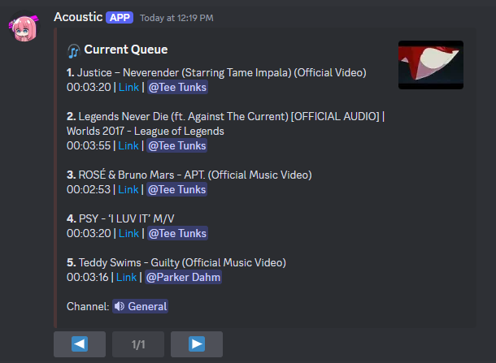
</p>

A Discord bot that allows users to play music and playlists from YouTube in a voice channel with custom commands for search, play, pause, and more. Spotify track, album, and playlist links are resolved to matching YouTube audio.
Supports multiple tracks, queue management, and interactive selection.

The main tools used are `yt-dlp` for pulling YouTube data and [FFmpeg](https://www.ffmpeg.org/) for audio streaming.

I used cogs since I adapt this code onto other bots that I have. It makes it a bit more modular since I can simply add the `Music` cog to a pre-existing bot.

## Features
See [Usage](#usage) for more information and examples on specific commands and features. Some of the music bot's features include:
- Search and play YouTube music directly in voice channels
- Resolve Spotify track, album, and playlist metadata to YouTube equivalents
- Queue management with pagination
- Like or dislike currently playing songs, with persistent guild statistics
- Support for multiple guilds via Sessions
- Select music using Discord interactions
- Auto leaving when the channel is empty or no music is playing

## Usage

Both slash-commands (`/`) and prefix commands (`.`) are supported. Prefix commands are available for servers that have disabled slash commands, but at least one command mode must be enabled. The default command prefix is `.` and can be changed per server with `.config` or in the `.env`. The bot's help message lists all available commands.

<details>
  <summary><code>/search &lt;song name&gt;</code> - Searches YouTube results</summary>

  Searches YouTube for the top 20 results and allows the user to select which one to add to the queue.
  
  <div class="image-container" align="center">
      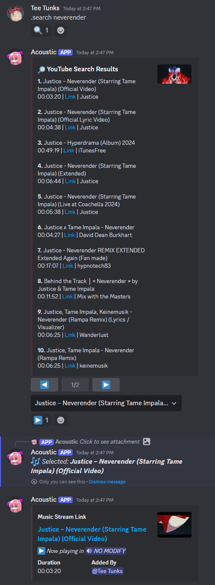
  </div>
</details>

<details>
  <summary><code>/play &lt;song name, YouTube URL, or YouTube playlist URL&gt;</code> - Plays a song or adds it to queue</summary>

  ```text
  .play Neverender by Tame Impala
  .play https://www.youtube.com/watch?v=E7FU_mqhFGk
  ```

  Searches for a song and plays the first result in the voice channel. 

  <div class="image-container" align="center">
      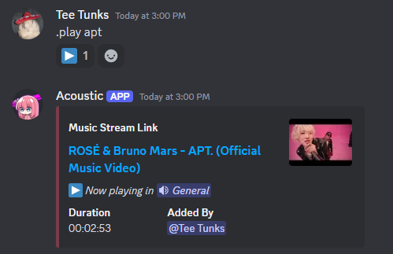
      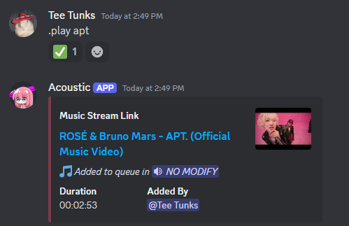
  </div>

  For playlists, you'll receive a prompt to select the number of tracks to queue and whether to shuffle them. Imports larger than 10 tracks queue the first 10 before the remaining tracks are added in the background; one import-status message is updated with progress and completion. The bot queues matches it finds and reports how many selected tracks could not be resolved. Some of the default options can be configured in the `.env` file, including the maximum number of tracks accepted from a playlist or album import, the default number of tracks to queue, and whether to shuffle them by default.

  ```text
  .play https://www.youtube.com/playlist?list=PLAYLIST_ID
  ```

  <div class="image-container" align="center">
      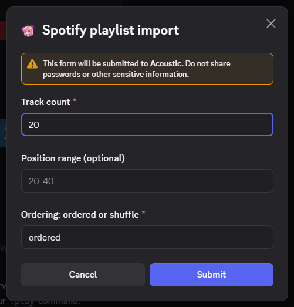
  </div>

  Alternatively, arguments can be used in the command. Use `--count`, `--range POSITION[,POSITION|START-END...]`, `--ordered`, or `--shuffle` to skip the prompt. Positions are 1-based and inclusive, so `1-3,5,7,9-10` selects positions 1, 2, 3, 5, 7, 9, and 10 in that order. Duplicate positions from overlapping ranges are included once.

  `--count` determines the final number of songs. If the requested ranges contain more songs than `--count`, the bot keeps the first selected songs in range order. If they contain fewer, it fills the remainder from the tracks immediately after the final requested range, stopping at the end of the playlist. For example, `--range 1-3,5,7,9-10 --count 10` selects positions 1, 2, 3, 5, 7, 9, 10, 11, 12, and 13. `--shuffle` randomizes the final selected songs after this expansion or trimming. If `--shuffle` is used without `--range`, the bot samples from every track in the playlist. If `--shuffle` is used with `--range`, the bot samples only from the selected tracks.

  ```text
  .play https://www.youtube.com/playlist?list=PLAYLIST_ID --count 20 --ordered
  .play https://www.youtube.com/playlist?list=PLAYLIST_ID --range 20-40 --count 10 --shuffle
  .play https://www.youtube.com/playlist?list=PLAYLIST_ID --range 1-3,5,7,9-10 --count 10 --ordered
  ```

</details>

<details>
  <summary><code>/play &lt;Spotify song URL or playlist URL&gt;</code> - Imports Spotify metadata as YouTube matches</summary>

  Spotify links do not stream Spotify audio directly. The bot reads Spotify metadata using credentials configured for this server, finds equivalent YouTube audio, and queues the successful matches.

  On the first Spotify request in a server, the requester receives a DM asking for a Spotify Client ID and Client Secret. The bot validates them before storing them encrypted in the persistent `data/spotify.db` volume. Any user in the bot's voice channel can replace or clear the server's credentials.

  Track and album links use the server's Spotify application credentials. Spotify requires user authorization to enumerate playlist items. On the first playlist request, the bot DMs the requester an authorization link; after accepting it, copy the complete redirected URL from the browser address bar into the DM. The encrypted refresh token is then stored per guild and renewed automatically. Register `SPOTIFY_REDIRECT_URI` exactly in the Spotify Developer Dashboard before using playlists. Spotify forbids `localhost`; for the manual callback flow, register and configure `http://127.0.0.1:8888/spotify-callback` instead. The browser may show a connection error after redirecting, which is expected: copy that page's complete address into the DM.

  <div class="image-container" align="center">
      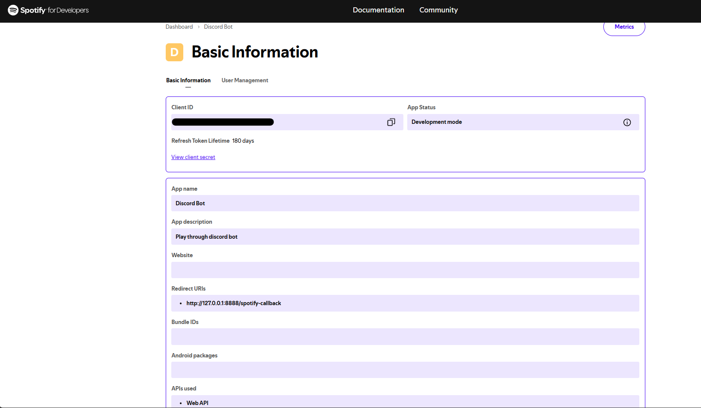
  </div>

  If the browser never displays the `http://127.0.0.1:8888/spotify-callback?...` URL, open its Developer Tools, select the **Network** tab, refresh the Spotify authorization page, click **Agree**, then copy the request URL whose path is `spotify-callback` into the bot DM. Do not post that URL in a server channel because it includes a short-lived authorization code.

  <div class="image-container" align="center">
      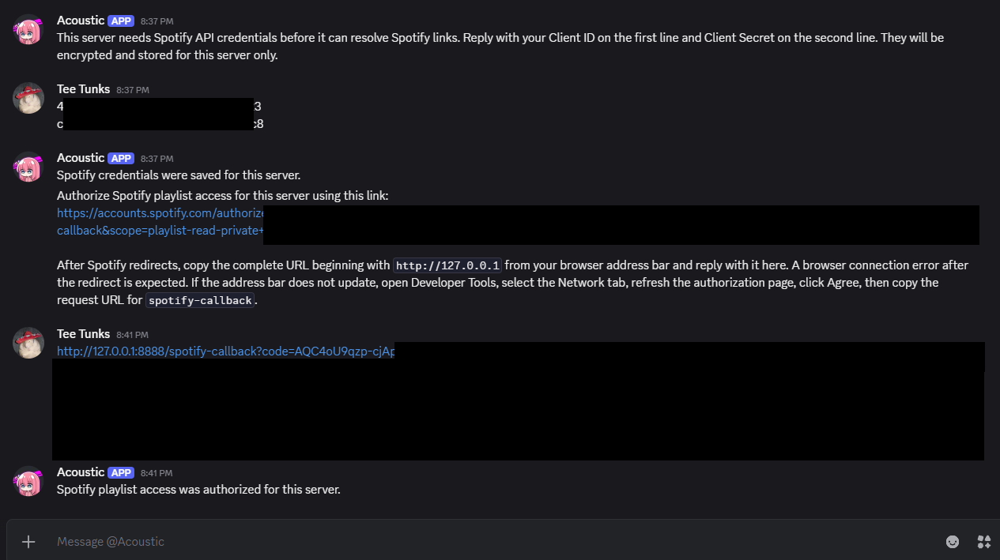
  </div>
  <div class="image-container" align="center">
      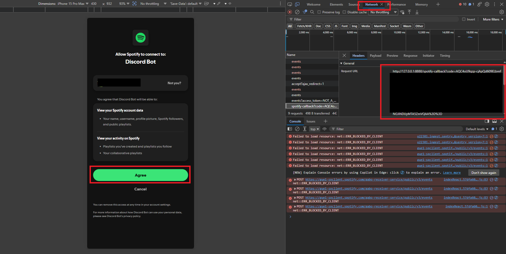
  </div>

  Spotify currently returns playlist items only for playlists owned by the authorizing account or where that account is a collaborator. For a public playlist owned by someone else, save or copy it into the authorizing Spotify account first. Playlists with no options open a requester-only configuration modal. Position selections use the same 1-based, inclusive `POSITION[,POSITION|START-END...]` format and count behavior described above.

  ```text
  /play https://open.spotify.com/track/4uLU6hMCjMI75M1A2tKUQC
  /play https://open.spotify.com/album/1ATL5GLyefJaxhQzSPVrLX --count 8 --ordered
  /play https://open.spotify.com/playlist/37i9dQZF1DXcBWIGoYBM5M --count 10 --shuffle
  /play https://open.spotify.com/playlist/37i9dQZF1DXcBWIGoYBM5M --range 20-40 --count 15 --ordered
  /play https://open.spotify.com/playlist/37i9dQZF1DXcBWIGoYBM5M --range 1-3,5,7,9-10 --count 10 --ordered
  /spotifyclear
  /spotifystatus
  ```

  The bot queues matches it finds and reports how many selected tracks could not be resolved. Spotify credentials, access tokens, and secrets are never sent to a server channel or logged.

  <div class="image-container" align="center">
      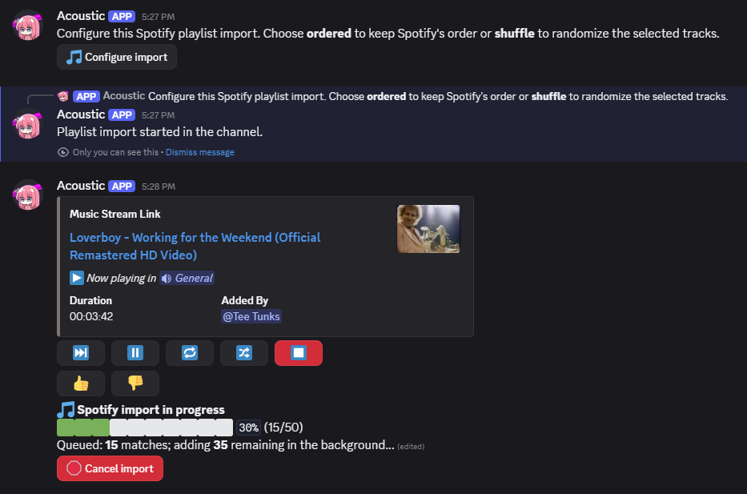
  </div>

</details>

<details>
  <summary><code>/playlist</code> - Creates, manages, and plays personal saved playlists</summary>

  Personal playlists belong to a Discord user rather than a server, so they are available anywhere that user can use the bot. Other members can view or queue a user's saved playlists, but only the owner can add, remove, move, or delete their songs. The default limits are three playlists and 50 saved songs across all of a user's playlists; bot operators can change them with `MAX_PLAYLISTS_PER_USER` and `MAX_SONGS_PER_USER`.

  `playlist add` accepts a YouTube search, a YouTube video or playlist URL, or a Spotify track, album, or playlist URL. When adding a YouTube or Spotify playlist URL, it always opens the same requester-only track-selection form used by `/play`: choose a count, positions/ranges, and ordered or shuffled results before tracks are saved. The form permits at most `min(PLAYLIST_MAX_TRACKS, MAX_SONGS_PER_USER)` tracks. It saves resolved YouTube matches, so playing a saved playlist queues those tracks without resolving them again. `/playlist play` also opens a requester-only configuration control, letting you choose which saved positions to queue and whether to preserve saved order or shuffle them. Slash-command add and remove confirmations are private to the requester and include a song embed.

  ```text
  /playlist                                      # List your playlists
  /playlist create Test Playlist
  /playlist add "Test Playlist" zenzenzen
  /playlist add "Test Playlist" https://www.youtube.com/playlist?list=PLAYLIST_ID
  /playlist add "Test Playlist" https://open.spotify.com/playlist/PLAYLIST_ID
  /playlist view                                 # List your playlists
  /playlist view name:"Test Playlist"            # View songs in one of your playlists
  /playlist view member:@Member                  # List another member's playlists
  /playlist view member:@Member name:"Test Playlist"
  /playlist remove "Test Playlist" 3
  /playlist move "Test Playlist" 3 1
  /playlist play "Test Playlist"
  /playlist play "Test Playlist" @Member
  /playlist delete "Test Playlist"
  ```

  Prefix commands use the same subcommands, for example `.playlist add "Test Playlist" zenzenzen`. Prefix responses are visible in the channel because Discord only supports private responses for slash commands.
</details>

<details>
  <summary><code>/pause</code> - Pauses the actively playing song</summary>

  <div class="image-container" align="center">
      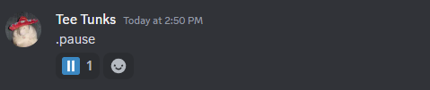
  </div>
</details>

<details>
  <summary><code>/resume</code> - Resumes the actively paused song</summary>

  <div class="image-container" align="center">
      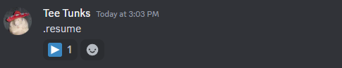
  </div>
</details>

<details>
  <summary><code>/skip</code> - Skips to the next song in the queue</summary>

  - Alias: `.next`

  Skips the current song and plays the next one in the queue if available. The skipped song is not removed from the queue.

  <div class="image-container" align="center">
      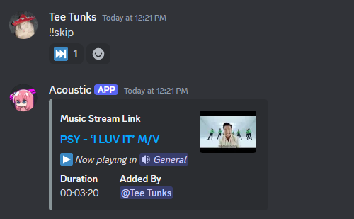
  </div>
</details>

<details>
  <summary><code>/seek &lt;position&gt;</code> - Jumps within the current song</summary>

  Use seconds, `MM:SS`, or `HH:MM:SS` for an absolute position. Prefix the value with `+` or `-` to move relative to the current position.

  ```text
  /seek +15       # Forward 15 seconds
  /seek +00:15    # Forward 15 seconds
  /seek 00:42     # Jump to 42 seconds from the beginning
  /seek -15       # Back 15 seconds
  /seek -00:15    # Back 15 seconds
  ```
</details>

<details>
  <summary><code>/restart</code> - Restarts the current song</summary>

  Starts the current song again from the beginning without changing the queue.
</details>

<details>
  <summary><code>/shuffle</code> - Shuffles upcoming songs</summary>

  Keeps the current song in place and randomizes the remaining queued songs.
</details>

<details>
  <summary><code>/stop</code> - Stops playing audio and clears the queue</summary>

  - Alias: `.reset`

  <div class="image-container" align="center">
      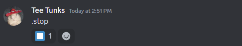
  </div>
</details>

<details>
  <summary><code>/here</code> - Moves the bot into the user's voice channel</summary>

  - Alias: `.join`

  Moves the bot to the user's current voice channel and updates the session.

  <div class="image-container" align="center">
      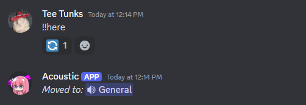
  </div>
</details>

<details>
  <summary><code>/leave</code> - Disconnects the bot from the voice channel and clears the queue</summary>

  <div class="image-container" align="center">
      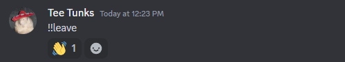
  </div>
</details>

<details>
  <summary><code>/clearqueue</code> - Clears the queue, except the currently playing song</summary>

  - Alias: `.clearQueue`, `.cq`, `.clear_next`, `.clearnext`, `.clearNext`, `.cn`

  <div class="image-container" align="center">
      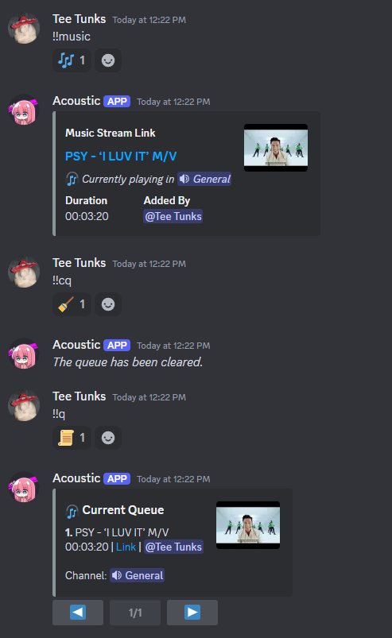
  </div>
</details>

<details>
  <summary><code>/playingnow</code> - Shows the current song</summary>
    
  - Alias: `.playingNow`, `.playing`, `.music`, `.nowplaying`, `.nowPlaying`, `.now`, `.musicnow`, `.musicNow`
    
  <div class="image-container" align="center">
      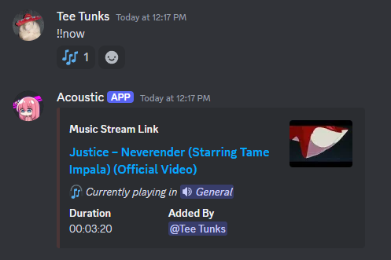
  </div>
</details>

<details>
  <summary>Song ratings and guild statistics</summary>

  The now-playing message includes Like and Dislike buttons. Each member has one rating per song in each server: choosing the other action replaces the current rating, and choosing the same action again removes it. Ratings are only available while the button's song is still playing.

  Song play counts are recorded when playback begins, including loop replays. All statistics are scoped to the current server and persist in `data/song_stats.db`.

  ```text
  /mostplayed       # Top 20 songs by playback starts
  /mostliked        # Top 20 songs by likes
  /mostdisliked     # Top 20 songs by dislikes
  /myliked          # Your 20 most recently liked songs in this server
  ```
</details>

<details>
  <summary><code>/queue</code> - Displays the current queue of songs</summary>

  - Alias: `.q`

  Displays the current queue of songs in groups of 10.

  <div class="image-container" align="center">
      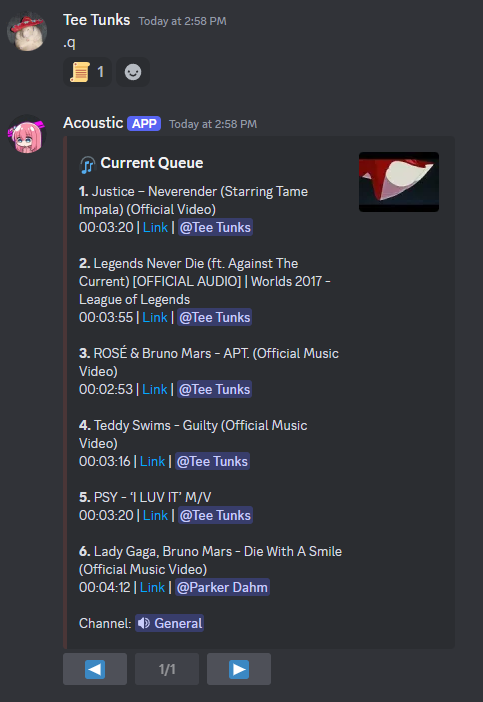
  </div>
</details>

<details>
  <summary><code>/remove</code> - Removes a selected upcoming song from the queue</summary>

  - Prefix command aliases: `.remove`, `.rm`

  `.remove` opens an ephemeral dropdown of upcoming songs. The prefix commands open a small in-channel button first, because Discord only supports ephemeral messages as interaction responses. After a selection, the bot posts the removed song in the server channel.
</details>

<details>
  <summary><code>/move</code> - Moves a selected upcoming song in the queue</summary>

  - Prefix command: `.move`

  Select an upcoming song, then select the song after which it should play. `.move` opens the private selector immediately; `.move` first posts a requester-only launcher button.
</details>


**Other Utility Commands**
| Command                            | Description                                                                                   |
|------------------------------------|-----------------------------------------------------------------------------------------------|
| `/help`                             | Shows the help message with all available commands.                                           |
| `/config`                           | Displays the server's current configuration and allows administrators to change it.           |
| `/ping`                             | Test command to check for basic bot responsiveness.                                           |
| `/time`                             | Displays the current time.                                                                    |
| `/up`                               | Reports container ID and uptime.                                                              |

### Interactions
This bot also includes Discord interactions for quick pause/play, skip, queue management, and like/dislike actions. The below image shows the interaction buttons that appear in the now-playing message. From left-to-right, the buttons are: ⏭️ Skip, ▶️ Play / ⏸️ Pause, 🔁 Loop, 🔀 Shuffle, ⏹️ Stop, 👍 Like, 👎 Dislike. The Like and Dislike buttons are only available while the song is actively playing. If the interactions expire when they should still be active (e.g. hitting it returns "the bot did not respond on time"), you can use `.now`/`.playingNow` to get refreshed interactions.
  <div class="image-container" align="center">
      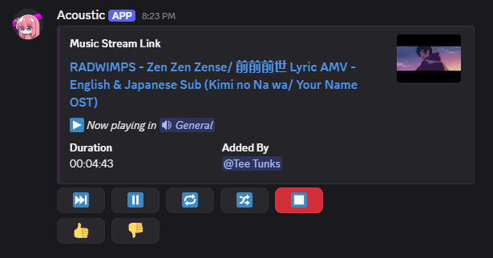
  </div>

Then for a queued song, the interaction buttons are 🗑️ Remove and ↕️ Move.
  <div class="image-container" align="center">
      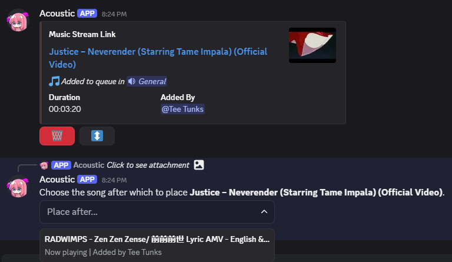
  </div>

## Installation Steps

### Creating a bot

1. **Create a Discord bot**:
   - Go to the [Discord Developer Portal](https://discord.com/developers/applications).
   - Click "New Application" and give your bot a name.
   - Under the "Bot" tab, click "Add Bot" (if needed) and confirm.
   - In the "TOKEN" section, click "Copy" to save your bot token, which will be used in your `.env` file.

2. **Installation Context**:
   - Under the installation tab, switch to "Guild Install" and change the "Install Link" to "None".
    <div class="image-container" align="center">
      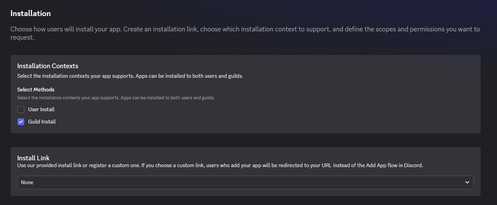
    </div>

3. **Set up permissions**:
   - In the "OAuth2" tab, select "bot" and "applications.commands" under "scopes."
   - Under "Bot Permissions," select the necessary permissions (such as "Send Messages," "Manage Messages," "Connect," "Speak," etc.). See the example below for recommended permissions.
    <div class="image-container" align="center">
      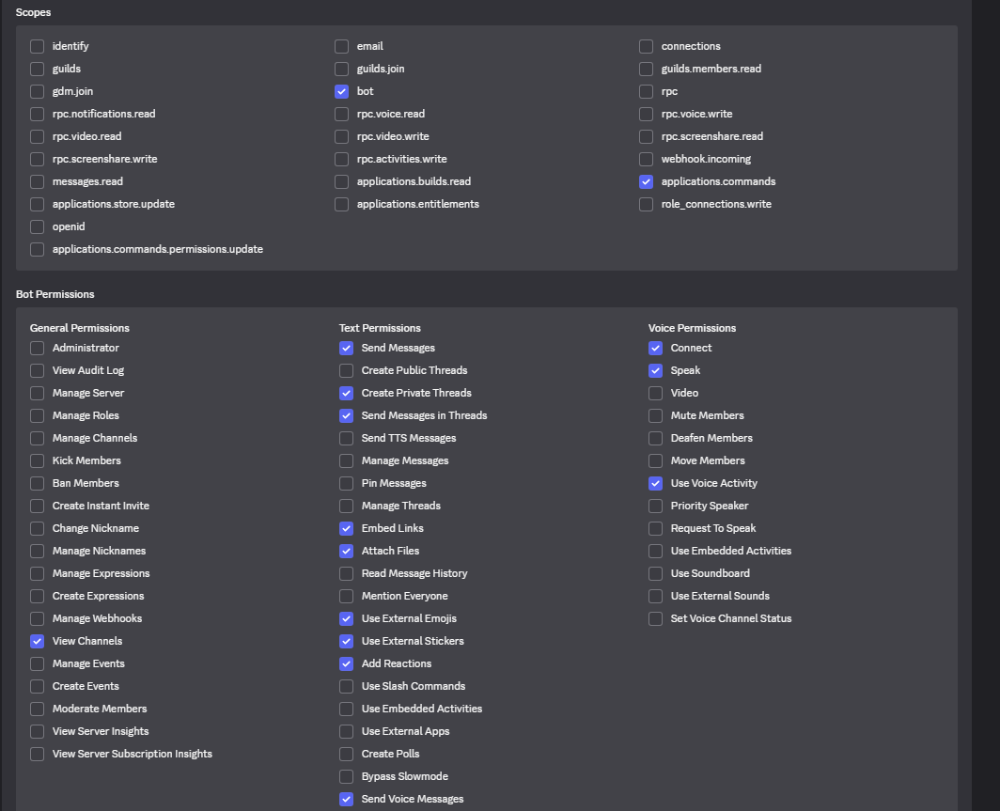
    </div>

4. **Intents**:
   - In the "Bot" tab, enable the necessary intents (such as "Presence Intent", "Server Members Intent," "Message Content Intent," etc.) to allow the bot to function properly.
    <div class="image-container" align="center">
      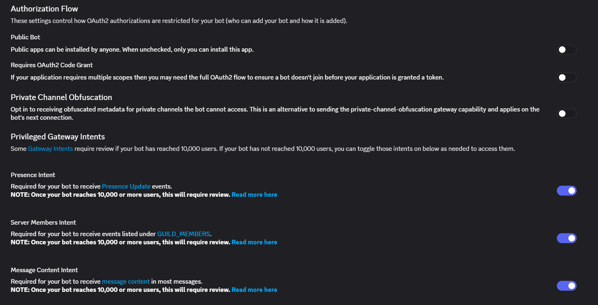
    </div>

5. **Invite your bot to a server**:
   - In the "OAuth2" tab, use the generated URL to invite the bot to your Discord server.

### Running through Docker

Use one of the following options to run the bot with Docker Compose.

#### **Option 1: Pull the published image**

1. **Create a directory for the deployment**:
  ```bash
  mkdir discord-music-bot
  cd discord-music-bot
  ```

2. **Create a `docker-compose.yaml` file**:
  ```yaml
  services:
    discord-music-bot:
     image: estessj/discord-music-bot:latest
     container_name: discord-music-bot
     restart: unless-stopped
     volumes:
      - ./logs:/app/logs
      - ./data:/app/data
     env_file:
      - .env
  ```

3. **Create a `.env` file in the root of the created directory**:
  ```env
  DISCORD_TOKEN=your-bot-token

  # Optional: defaults to daily at 04:00 in the container's time zone.
  YTDLP_UPDATE_SCHEDULE="0 4 * * *"

  # Required only for Spotify link support. This must be a Fernet key.
  SPOTIFY_CREDENTIAL_ENCRYPTION_KEY=replace-with-a-fernet-key
  SPOTIFY_MARKET=US
  SPOTIFY_REDIRECT_URI=http://127.0.0.1:8888/spotify-callback
  ```

4. **Pull and start the bot**:
  ```bash
  docker compose pull
  docker compose up -d
  ```

#### **Option 2: Build from source**

1. **Clone the repository**:
   ```bash
   git clone https://github.com/estes-sj/discord-music-bot.git
   cd discord-music-bot
   ```

2. **Create the environment file in the root of the cloned repository**:
   ```env
   DISCORD_TOKEN=your-bot-token

   # Optional: defaults to daily at 04:00 in the container's time zone.
   YTDLP_UPDATE_SCHEDULE="0 4 * * *"

   # Required only for Spotify link support. This must be a Fernet key.
   SPOTIFY_CREDENTIAL_ENCRYPTION_KEY=replace-with-a-fernet-key
   SPOTIFY_MARKET=US
   SPOTIFY_REDIRECT_URI=http://127.0.0.1:8888/spotify-callback
   ```

3. **Build and start the bot**:
   ```bash
   docker compose up -d --build
   ```

Once the bot is running, it will appear online in your Discord server and be able to join voice channels and play music.

## Configuration

### Environment Variables
| Variable | Default | Example | Description |
| --- | --- | --- | --- |
| `DISCORD_TOKEN` | None | `DISCORD_TOKEN=your-bot-token` | Bot token from the Discord Developer Portal. |
| `COMMAND_PREFIX` | `.` | `COMMAND_PREFIX=!` | Prefix used for bot commands and the displayed help activity. |
| `SLASH_COMMANDS_ENABLED` | `true` | `SLASH_COMMANDS_ENABLED=false` | Makes slash commands available to guilds. A value of `false` cannot be overridden by guild configuration. |
| `PREFIX_COMMANDS_ENABLED` | `true` | `PREFIX_COMMANDS_ENABLED=false` | Makes prefix commands available to guilds. A value of `false` cannot be overridden by guild configuration. At least one command mode must be enabled. |
| `LOG_MAX_BYTES` | `8388608` | `LOG_MAX_BYTES=16777216` | Maximum size, in bytes, of each `logs/discord.log` file before rotation. |
| `LOG_BACKUP_COUNT` | `5` | `LOG_BACKUP_COUNT=10` | Number of rotated `discord.log` files to retain. |
| `YTDLP_TIMEOUT_SECONDS` | `45` | `YTDLP_TIMEOUT_SECONDS=60` | Maximum seconds to wait for one yt-dlp source-resolution operation before returning a safe failure. |
| `PLAY_COOLDOWN_SECONDS` | `0` | `PLAY_COOLDOWN_SECONDS=10` | Per-user, per-server cooldown for `/play` and the prefix equivalent. `0` disables this cooldown. |
| `SEARCH_COOLDOWN_SECONDS` | `1` | `SEARCH_COOLDOWN_SECONDS=5` | Per-user, per-server cooldown for `/search` and the prefix equivalent. `0` disables this cooldown. |
| `PLAYLIST_IMPORT_CONCURRENCY_PER_GUILD` | `1` | `PLAYLIST_IMPORT_CONCURRENCY_PER_GUILD=2` | Maximum simultaneous playlist imports within one server. Keep `1` unless host capacity testing supports more. |
| `MAX_PLAYLISTS_PER_USER` | `3` | `MAX_PLAYLISTS_PER_USER=5` | Maximum personal playlists a Discord user can create. |
| `MAX_SONGS_PER_USER` | `50` | `MAX_SONGS_PER_USER=100` | Maximum tracks a Discord user can save across all of their personal playlists. |
| `GUILD_CONFIG_DATABASE_PATH` | `/app/data/guild_config.db` | `GUILD_CONFIG_DATABASE_PATH=/app/data/guild_config.db` | SQLite database for per-server music configuration overrides. |
| `AUTO_DISCONNECT_EMPTY_CHANNEL_ENABLED` | `true` | `AUTO_DISCONNECT_EMPTY_CHANNEL_ENABLED=false` | Whether the bot leaves when it is the only member left in its voice channel. |
| `AUTO_DISCONNECT_EMPTY_CHANNEL_MINUTES` | `0` | `AUTO_DISCONNECT_EMPTY_CHANNEL_MINUTES=5` | Minutes to wait after the bot is alone before leaving. `0` leaves at the next check. |
| `AUTO_DISCONNECT_INACTIVITY_ENABLED` | `true` | `AUTO_DISCONNECT_INACTIVITY_ENABLED=false` | Whether the bot leaves after playback inactivity. |
| `AUTO_DISCONNECT_INACTIVITY_MINUTES` | `10` | `AUTO_DISCONNECT_INACTIVITY_MINUTES=30` | Minutes without playback before the bot leaves. |
| `YTDLP_UPDATE_SCHEDULE` | `0 4 * * *` | `YTDLP_UPDATE_SCHEDULE="0 8 * * *"` | Cron expression for yt-dlp updates. Output is written to `logs/yt-dlp-update.log`. |
| `SONG_STATS_DATABASE_PATH` | `/app/data/song_stats.db` | `SONG_STATS_DATABASE_PATH=/app/data/song_stats.db` | SQLite database for persistent, guild-scoped song play counts and ratings. |
| `USER_PLAYLIST_DATABASE_PATH` | `/app/data/user_playlists.db` | `USER_PLAYLIST_DATABASE_PATH=/app/data/user_playlists.db` | SQLite database for persistent personal playlists, shared by the user's bot account across servers. |
| `SPOTIFY_CREDENTIAL_ENCRYPTION_KEY` | None | `SPOTIFY_CREDENTIAL_ENCRYPTION_KEY=...` | Fernet key used to encrypt per-guild Spotify Client IDs and Client Secrets at rest. Generate one with `python -c "from cryptography.fernet import Fernet; print(Fernet.generate_key().decode())"`. Required for Spotify support. |
| `SPOTIFY_DATABASE_PATH` | `/app/data/spotify.db` | `SPOTIFY_DATABASE_PATH=/app/data/spotify.db` | SQLite database containing encrypted guild credential records. Mount `/app/data` to retain it across container replacement. |
| `PLAYLIST_MAX_TRACKS` | `20` | `PLAYLIST_MAX_TRACKS=50` | Maximum number of tracks accepted from an album or playlist import. |
| `PLAYLIST_DEFAULT_TRACKS` | `20` | `PLAYLIST_DEFAULT_TRACKS=10` | Track count used by the playlist configuration modal and imports without an explicit count. |
| `PLAYLIST_DEFAULT_SHUFFLE` | `false` | `PLAYLIST_DEFAULT_SHUFFLE=true` | Whether playlist imports shuffle eligible tracks by default. |
| `SPOTIFY_MARKET` | `US` | `SPOTIFY_MARKET=CA` | Two-letter country code used to determine Spotify catalog availability for the Client Credentials flow. Set this to the bot's intended region. |
| `SPOTIFY_REDIRECT_URI` | None | `SPOTIFY_REDIRECT_URI=http://127.0.0.1:8888/spotify-callback` | Exact callback URL registered in the Spotify Developer Dashboard for one-time playlist authorization. Spotify permits HTTP only for an explicit loopback IP, not `localhost` or a LAN/server IP. The authorizing user copies the redirected URL to the bot's DM. Required for playlists. |

Server administrators can run `.config` or `/config` to set a server-specific command prefix, command modes, auto-disconnect policies, and playlist defaults. Guilds can disable either prefix or slash commands, but must keep one mode enabled. `SLASH_COMMANDS_ENABLED=false` or `PREFIX_COMMANDS_ENABLED=false` is an operator-level restriction and prevents guild administrators from re-enabling that mode. These overrides are stored in `GUILD_CONFIG_DATABASE_PATH`; environment values remain the defaults for servers without an override.

## Troubleshooting

### Stuttering audio
If the container logs include something like `[youtube] player: Signature extraction failed: Some formats may be missing`, chances are yt-dlp has to be updated for those changed/new formats.
If it has been awhile since rebuilding containers, it is recommended to see if it picks up a newer version of yt-dlp and solves the issue. Ensure `YTDLP_UPDATE_SCHEDULE` is set in the `.env` file to automatically update yt-dlp on a schedule.

One way without rebuilding the container is to run the following command in the container to manually update:
```bash
# Update yt-dlp to the latest version
docker compose exec -T discord-music-bot python3 -m pip install --no-cache-dir --upgrade yt-dlp
# Check the version
docker compose exec -T discord-music-bot yt-dlp --version
```

## Audio Quality Limitations

The bot streams the best audio format that `yt-dlp` can obtain from the selected YouTube result, but it cannot improve the quality of that source. YouTube uploads may already be low bitrate, dynamically compressed, clipped, or distorted. This is most noticeable in music with sharp, loud transients or a wide dynamic range, such as orchestral cannon shots, percussion-heavy tracks, and bass-heavy music.

Discord voice channels also impose a bitrate limit and transmit audio with Opus. The available channel bitrate depends on the server's boost level, so listeners may hear additional compression artifacts or reduced detail compared with the original upload. Use the highest voice-channel bitrate your server allows and try a different YouTube recording or remaster when a specific track sounds distorted.

Seeking restarts the stream at the selected position; it may briefly buffer, but it does not increase or intentionally reduce the selected source quality.

## Bugs
Please use the [bug report template](.github/ISSUE_TEMPLATE/bug_report.yml) for reproducible problems and the [closed beta feedback template](.github/ISSUE_TEMPLATE/beta_feedback.yml) for usability feedback. Review [CONTRIBUTING.md](CONTRIBUTING.md) before opening a pull request. Do not report vulnerabilities or expose secrets in a public issue; follow [SECURITY.md](SECURITY.md) instead.

## License

This project is licensed under the GNU General Public License v3.0 - see the [LICENSE](LICENSE) file for details.